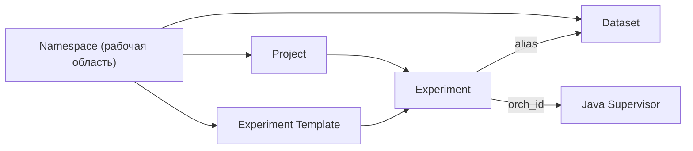

# Документация репозитория Control Plane

Точка входа для разработчиков и для агентов: **навигация по архитектуре, сущностям и справочникам**. Новые страницы оформляйте по [`TEMPLATE.md`](TEMPLATE.md) (фиксированные заголовки H2 — якоря для поиска и ссылок).

Материалы для текстов в интерфейсе («О платформе», «Обучение») могут ссылаться на эти файлы в Git или Wiki. Стартовый контент CMS задаётся из [`../backend/internal/bootstrap/cms/defaults/`](../backend/internal/bootstrap/cms/defaults/).

## Структура каталога `docs/`

| Папка / файл | Содержание |
|----------------|------------|
| [`README.md`](README.md) | Этот индекс |
| [`TEMPLATE.md`](TEMPLATE.md) | Шаблон новых страниц |
| [`architecture/`](architecture/) | Супервизор, контур управления |
| [`entities/`](entities/) | Сущности предметной области (модель, API, сервис) |
| [`database/`](database/) | Схема БД (DBML) |
| [`guides/`](guides/) | Практические гайды (демо-стенд и далее) |
| [`reference/`](reference/) | ВКР, проектные PDF/DOCX, сопутствующие материалы |
| [`reference/papers/`](reference/papers/) | Научные статьи (библиография) |

## Связи основных сущностей

## Архитектура

| Документ | Назначение |
|----------|------------|
| [`architecture/supervisor-architecture.md`](architecture/supervisor-architecture.md) | Интеграция CPLANE с Java-супервизором: RabbitMQ (команды), HTTP (статус), сборка конфига, `orch_id`, конфигурация клиентов. |
| [`architecture/control-loop.md`](architecture/control-loop.md) | Контур управления: сценарии start / stop / apply, статус, маппинг, обогащение задач, поведение без брокера или без `base_url`. |

## Сущности

| Документ | Назначение | Таблицы БД (основные) | Сервис |
|----------|------------|----------------------|--------|
| [`entities/namespace.md`](entities/namespace.md) | Рабочая область (неймспейс), конфиг и ACL | `t_namespace`, `t_namespace_config_v`, `t_namespace_update_log` | [`namespace_service.go`](../backend/internal/service/namespace/namespace_service.go) |
| [`entities/project.md`](entities/project.md) | Проект внутри неймспейса, конфиг, закладки | `t_project`, `t_project_config_v`, `t_project_update_log`, `t_user_pinned_projects` | [`project_service.go`](../backend/internal/service/project/project_service.go) |
| [`entities/experiment.md`](entities/experiment.md) | Эксперимент, шаблон, переменные, связь с датасетами и супервизором | `t_experiment`, `t_experiment_template`, `t_experiment_template_v`, `t_experiment_dataset`, `t_experiment_io`, `t_experiment_variable`, `t_experiment_variable_v`, `t_experiment_status`, `t_experiment_update_log` | [`experiment_service.go`](../backend/internal/service/experiment/experiment_service.go), [`experiment_actions_service.go`](../backend/internal/service/experiment/experiment_actions_service.go) |
| [`entities/dataset.md`](entities/dataset.md) | Датасет, версии, привязка к проекту/неймспейсу | `t_dataset`, `t_dataset_v`, `t_dataset_update_log` | [`dataset_service.go`](../backend/internal/service/dataset/dataset_service.go) |

## Схема данных

| Файл | Назначение |
|------|------------|
| [`database/cplane.dbml`](database/cplane.dbml) | Схема PostgreSQL в DBML (в т.ч. `000001_init`). Импорт в [dbdiagram.io](https://dbdiagram.io): **Database → Import → DBML**. |

## Гайды

| Файл | Назначение |
|------|------------|
| [`guides/demo-stand.md`](guides/demo-stand.md) | Тестовый стенд: демо-неймспейс `demo-stand-skif`, проект, датасеты и эксперимент (миграция `000008_demo_stand_seed`). |

## Справочные и проектные материалы

| Файл | Назначение |
|------|------------|
| [`reference/first_vkr_draft.md`](reference/first_vkr_draft.md) | Черновик ВКР: контекст ЦКП СКИФ, архитектура, ссылка на DBML. |
| [`reference/Проектное предложение Control Plane.pdf`](reference/Проектное%20предложение%20Control%20Plane.pdf) | Проектное предложение (PDF). |
| [`reference/ВКР ТЗ.pdf`](reference/ВКР%20ТЗ.pdf) | Техническое задание (PDF). |
| [`reference/Первый_вариант_ВКР_Control_Plane.docx`](reference/Первый_вариант_ВКР_Control_Plane.docx) | Первый вариант ВКР (DOCX). |
| [`reference/papers/1-s2.0-S0950584924001083-main.pdf`](reference/papers/1-s2.0-S0950584924001083-main.pdf) | Литература (статья, PDF). |

## Roadmap документации

- **`docs/services/`** — краткий каталог пакетов [`backend/internal/service/`](../backend/internal/service/) (auth, acl, cube, …) с границами ответственности.
- Дополнительные **`docs/guides/`** — локальная разработка, деплой, отладка RabbitMQ/супервизора (с перекрёстными ссылками на `architecture/` и корневой [`README.md`](../README.md)).

## GitHub Wiki (автосинхронизация с `docs/`)

В репозитории включён workflow [`.github/workflows/sync-docs-to-wiki.yml`](../.github/workflows/sync-docs-to-wiki.yml): при push в ветку `main` или `master`, если менялись файлы под `docs/` или сам workflow, содержимое **`docs/`** зеркалируется в **GitHub Wiki** того же репозитория (`rsync --delete`, полное совпадение дерева). Файл **`docs/README.md`** на стороне Wiki переименовывается в **`Home.md`** (так устроена главная страница Wiki).

**Настройка один раз**

1. В настройках репозитория GitHub включите **Wiki** (Settings → General → Features → Wikis).
2. При необходимости создайте первую страницу Wiki в UI или выполните один push в `.wiki.git`, чтобы репозиторий Wiki существовал (иначе `git clone …wiki.git` может завершиться ошибкой).
3. Создайте [classic Personal Access Token](https://github.com/settings/tokens) с областью **`repo`** (достаточно для push в wiki того же репозитория).
4. В репозитории: **Settings → Secrets and variables → Actions → New repository secret** — имя **`WIKI_PUSH_TOKEN`**, значение — PAT.

Ручной запуск: вкладка **Actions → Sync docs to Wiki → Run workflow**.

Относительные ссылки из markdown на файлы вне `docs/` (например `../backend/`) в интерфейсе Wiki вести не будут — это ограничение зеркалирования; каноничная версия остаётся в основном репозитории.

## Рекомендуемые внешние ссылки для блока «О платформе»

Подставьте вместо заглушек URL вашей организации:

- Wiki или Confluence с пользовательским руководством;
- GitLab/GitHub с каталогом `docs/` (этот README);
- канал поддержки или трекер задач.
