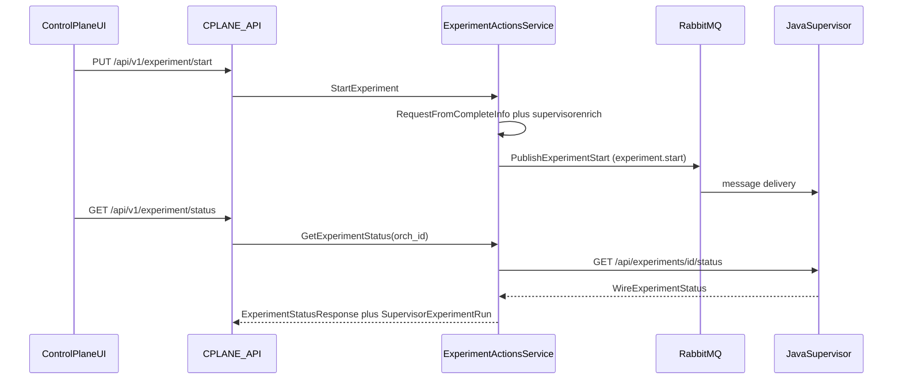

# Контур управления экспериментом (control loop)

Кратко: CPLANE **не исполняет** пайплайн; он отправляет команды в **RabbitMQ**, опционально читает **HTTP-статус** у Java-супервизора и сохраняет метаданные в PostgreSQL. Транспорт, форматы сообщений и конфигурация клиентов — в [supervisor-architecture.md](supervisor-architecture.md).

## Назначение

Описать сквозной сценарий: **запуск**, **остановка**, **применение конфигурации**, **получение статуса** и **обогащение списка задач** живыми данными супервизора и глубиной очереди.

## Связь с другими сущностями

- Эксперимент хранится в CPLANE ([`entities/experiment.md`](../entities/experiment.md)); поле **`orch_id`** связывает запись с рантаймом супервизора.
- Датасеты и переменные попадают в собранный JSON перед публикацией в брокер.

## Модель данных

Для контура важны:

- [`t_experiment`](../database/cplane.dbml#L199-L208) — `status`, **`orch_id`** (строка; для HTTP должен парситься в положительный int64).
- [`t_experiment_status`](../database/cplane.dbml#L255-L265) — применённая версия и снимок конфига после **apply** (`InsertExperimentAppliedVersion` в SQL-слое).

Полная схема — [`database/cplane.dbml`](../database/cplane.dbml).

## HTTP API (операции контура)

Регистрация маршрутов: [`backend/internal/handlers/private/handlers.go`](../../backend/internal/handlers/private/handlers.go).

| Метод | Путь | Назначение | Handler |
|-------|------|------------|---------|
| PUT | `/api/v1/experiment/start` | Запуск пайплайна (публикация в RabbitMQ) | [`experiment_actions.go`](../../backend/internal/handlers/private/experiment_actions.go) `ExperimentStartHandler` |
| PUT | `/api/v1/experiment/stop` | Остановка | `ExperimentStopHandler` |
| GET | `/api/v1/experiment/status` | Статус (HTTP к супервизору при настроенном `base_url`) | `ExperimentStatusHandler` |
| PUT | `/api/v1/experiment/config/apply` | Применить конфиг (публикация `experiment.apply`, обновление `t_experiment_status`) | [`apply_experiment_config.go`](../../backend/internal/handlers/private/apply_experiment_config.go) `ApplyExperimentConfigHandler` |

Подробнее о модели данных и HTTP API эксперимента — в [`entities/experiment.md`](../entities/experiment.md).

## Сервис

[`backend/internal/service/experiment/experiment_actions_service.go`](../../backend/internal/service/experiment/experiment_actions_service.go):

- **`StartExperiment`** — загрузка `CompleteExperimentInfo`, сборка `supervisor.ExperimentRequest` (`RequestFromCompleteInfo`), подстановка переменных (`supervisorenrich.ApplyExperimentVariables`), `PublishExperimentStart`.
- **`StopExperiment`** — `PublishExperimentStop` с `experiment_id` и `supervisor_experiment_id` из **`orch_id`**.
- **`ApplyExperimentConfig`** — та же сборка, что для старта → `PublishExperimentApply` → сохранение применённой версии в **`t_experiment_status`**.
- **`GetExperimentStatus`** — при пустом `clients.supervisor.base_url` возвращается заглушка со статусом `UNKNOWN`; при невалидном `orch_id` — поясняющее сообщение; иначе `supervisorstatus.Fetch` по `GET {baseURL}/api/experiments/{id}/status`.
- **`GetSupervisorExperimentID`** — чтение `orch_id` из полного снимка эксперимента.

## Сборка запроса и обогащение

| Пакет | Роль |
|-------|------|
| [`internal/pkg/supervisor`](../../backend/internal/pkg/supervisor) | `ExperimentRequest`, `RequestFromCompleteInfo`, распознавание layout супервизора |
| [`internal/pkg/supervisorenrich`](../../backend/internal/pkg/supervisorenrich) | Подстановка переменных эксперимента в JSON |
| [`internal/pkg/orch`](../../backend/internal/pkg/orch) | Конвертация из модели оркестратора, если конфиг не в layout супервизора |

## RabbitMQ

[`backend/internal/clients/rabbitmq/`](../../backend/internal/clients/rabbitmq/) — exchange (по умолчанию topic `cplane.events`), routing keys `experiment.start` / `experiment.stop` / `experiment.apply`, persistent JSON. Тела — см. [`events.go`](../../backend/internal/clients/rabbitmq/events.go).

Без включённого и успешно инициализированного клиента операции start/stop/apply завершаются ошибкой (супервизор команды не получает).

## HTTP-статус и маппинг

[`internal/pkg/supervisorstatus`](../../backend/internal/pkg/supervisorstatus) — HTTP GET к супервизору.

Агрегированный статус в DTO: **`mapJavaSupervisorStatusToDTO`** в `experiment_actions_service.go`:

| Java (супервизор) | DTO CPLANE |
|-------------------|------------|
| `QUEUED`, `RUNNING` | `PENDING` |
| `COMPLETED` | `OK` |
| `FAILED` | `ERROR` |
| `CANCELLED` | `WARNING` |
| иное / пусто | `UNKNOWN` |

Детальный ответ — **`SupervisorExperimentRun`** в [`experiment_responses.go`](../../backend/internal/entities/responses/experiment_responses.go).

## Поле `orch_id`

- **Запись при создании/копировании** эксперимента: [`UpdateExperimentOrchID`](../../backend/internal/service/experiment/experiment_service.go) (значение связано с id эксперимента в CPLANE).
- **Stop** — в сообщение уходит как `supervisor_experiment_id`.
- **Status** — в URL супервизора подставляется как числовой id; должен быть **> 0** после парсинга.

## Обогащение задач

[`backend/internal/handlers/private/experiment_jobs.go`](../../backend/internal/handlers/private/experiment_jobs.go) — функция **`applyLiveSupervisorAndQueue`**: для записей start/apply подмешивает живой статус и стадии из ответа супервизора; при настроенном RabbitMQ может добавить сведения о глубине очереди (`supervisor_queue`, passive declare).

## Поведение при отсутствии интеграций

- **Нет RabbitMQ** — start/stop/apply недоступны (ошибка на стороне API/сервиса).
- **Нет `clients.supervisor.base_url`** — детальный HTTP-статус не запрашивается; в ответе возможна заглушка про необходимость URL.

Конфигурация: [`backend/config.local.yaml`](../../backend/config.local.yaml), структуры в [`internal/config`](../../backend/internal/config).

## DTO / requests / responses

- [`experiment_responses.go`](../../backend/internal/entities/responses/experiment_responses.go) — `ExperimentStatusResponse`, `SupervisorExperimentRun`.
- Запросы старта/стопа/apply — `internal/entities/requests` (типы `ExperimentStartRequest`, …).

## Репозиторий и SQL

[`repository.go`](../../backend/internal/repository/repository.go); для apply — запросы в [`experiment_actions.sql`](../../backend/internal/db/queries/experiment_actions.sql), [`complete_experiment_info.sql`](../../backend/internal/db/queries/complete_experiment_info.sql).

## Версионирование

При **apply** обновляется **`t_experiment_status`** (текущая применённая версия и `orch_config`). Версии шаблона/переменных — см. [`entities/experiment.md`](../entities/experiment.md).

## Журнал изменений

Хендлеры start/stop/apply вызывают **`LogExperimentChange`** (см. `experiment_actions.go`, `apply_experiment_config.go`) — записи в **`t_experiment_update_log`**.

## ACL

Проверки прав на операции эксперимента выполняются в соответствующих handlers (`start` / `stop` / `apply`, чтение статуса). Базовый пакет: [`internal/pkg/acl`](../../backend/internal/pkg/acl).
Подробно о ролях, правилах и вычислении эффективных прав: [`entities/acl.md`](../entities/acl.md).

## Интерфейс Control Plane: запуск и отображение запусков

Фронтенд **не заменяет** контур RabbitMQ / HTTP супервизора: он вызывает те же HTTP API, что описаны выше.

### Запуск пайплайна

- Кнопка запуска приводит к **`PUT /api/v1/experiment/start`** (через сгенерированный клиент `v1ExperimentStartUpdate`).
- Реализация на фронте: [`frontend/src/modules/control-plane/features/experiment/run/model/model.ts`](../../frontend/src/modules/control-plane/features/experiment/run/model/model.ts) (mutation + уведомление об успехе).
- Права на действие в UI проверяются через **`RightStartExperiment`** и утилиту [`authz.ts`](../../frontend/src/modules/control-plane/shared/utils/authz.ts).

### Статус и «запуски» на вкладке Jobs

- Актуальное состояние пайплайна для экрана эксперимента запрашивается **`GET /api/v1/experiment/status`**.
- Обёртка запроса: [`frontend/src/modules/control-plane/entities/experiments/model/status.ts`](../../frontend/src/modules/control-plane/entities/experiments/model/status.ts) (`createQuery` → `v1ExperimentStatusList`), используется страницей проекта (`projectPageModel.experiment.status`).
- Вкладка **Jobs** ([`pages/project/ui/components/experiment/tabs/jobs-tab.tsx`](../../frontend/src/modules/control-plane/pages/project/ui/components/experiment/tabs/jobs-tab.tsx)) отображает агрегированный статус и блок **`supervisor`** из ответа (`SupervisorExperimentRun`): стадии моделей либо из поля `jobs`, либо синтетически по `total_models` / `current_order` / `status`, если супервизор не вернул пошаговый список (та же логика на backend в [`experiment_jobs.go`](../../backend/internal/handlers/private/experiment_jobs.go) `mapSupervisorRunToStages`).
- Расширенный поиск задач оркестратора (**`POST /api/v1/jobs/search`**, отмена, retry и т.д.) описан в [`entities/experiment.md`](../entities/experiment.md) и используется там, где UI вызывает jobs API; вкладка Jobs в первую очередь опирается на **статус эксперимента** и журнал, а не на отдельный список jobs.

Кратко про сессию и cookie при вызовах API: [`frontend-auth-session.md`](frontend-auth-session.md).

## См. также

- [supervisor-architecture.md](supervisor-architecture.md)
- [entities/experiment.md](../entities/experiment.md)
- [entities/cube.md](../entities/cube.md)
- [frontend-auth-session.md](frontend-auth-session.md)
- [frontend-experiment-graph.md](frontend-experiment-graph.md)
- [docs/README.md](../README.md)
