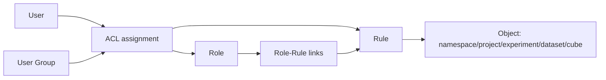

# Сущность: ACL (система прав)

## Назначение

**ACL** в CPLANE определяет, кто и какие действия может выполнять над объектами (`namespace`, `project`, `experiment`, `dataset`, `cube`). Модель строится на связке **правило -> роль -> пользователь/группа** и используется как в UI-операциях, так и в backend handlers.

Коротко: роль - это контейнер правил, а эффективные права пользователя считаются как объединение его прямых назначений и назначений через группы.

## Связь с другими сущностями

- Пользователи и группы: `t_user`, `t_user_group`, `t_user_group_match`.
- Правила и роли: `t_rule`, `t_role`, `t_role_match`.
- Привязка прав: `t_acl_match`, `t_user_rule`.
- Объекты доступа: namespace/project/experiment/dataset/cube.

## Модель данных

| Таблица | Назначение | DBML |
|---------|------------|------|
| `t_user_group` | Группы пользователей | [L31-L38](../database/cplane.dbml#L31-L38) |
| `t_user_group_match` | Пользователь -> группа | [L40-L47](../database/cplane.dbml#L40-L47) |
| `t_role` | Роль (набор правил) | [L49-L58](../database/cplane.dbml#L49-L58) |
| `t_rule` | Правило доступа (object/action) | [L60-L70](../database/cplane.dbml#L60-L70) |
| `t_role_match` | Правило -> роль | [L72-L79](../database/cplane.dbml#L72-L79) |
| `t_acl_match` | Назначение роли/правила пользователю или группе | [L81-L94](../database/cplane.dbml#L81-L94) |
| `t_user_rule` | Материализованные user-rule связи | [L96-L100](../database/cplane.dbml#L96-L100) |

## HTTP API

Маршруты зарегистрированы в [`backend/internal/handlers/private/handlers.go`](../../backend/internal/handlers/private/handlers.go).

### Роли и правила

| Метод | Путь | Назначение |
|-------|------|------------|
| POST | `/api/v1/role` | create role |
| PUT | `/api/v1/role` | update role |
| GET | `/api/v1/roles` | list roles |
| POST | `/api/v1/rule` | create rule |
| GET | `/api/v1/rules` | list rules of role |
| POST | `/api/v1/role/rule` | add rule to role |
| DELETE | `/api/v1/role/rule` | remove rule from role |

### Назначения прав

| Метод | Путь | Назначение |
|-------|------|------------|
| POST | `/api/v1/grant` | выдать роль/правило пользователю или группе |
| POST | `/api/v1/disclaim` | отобрать роль/правило |
| POST | `/api/v1/usergroup/user` | добавить пользователя в группу |
| DELETE | `/api/v1/usergroup/user` | удалить пользователя из группы |
| GET | `/api/v1/user_matches` | эффективные правила пользователя |
| GET | `/api/v1/user_group_matches` | эффективные правила группы |

### Проверка прав (v2)

| Метод | Путь | Назначение |
|-------|------|------------|
| GET | `/api/v2/acl/check` | права текущего пользователя на объект |
| GET | `/api/v2/acl/users` | пользователи и их права на объект |
| GET | `/api/v2/me/capabilities` | capability-флаги текущего пользователя |

Дополнительно для совместимости остается `GET /api/v1/permissions` (старый формат проверки).

## Сервис

Основная логика: [`backend/internal/service/acl/acl_service.go`](../../backend/internal/service/acl/acl_service.go).

- `Grant` / `Disclaim` - выдача и отзыв ролей/правил.
- `AddUserToGroup` / `RemoveUserFromGroup` - управление составом групп.
- `CreateRole`, `UpdateRole`, `ListRoles` - управление ролями.
- `CreateRule`, `ListRoleRules`, `AddRuleToRole`, `RemoveRuleFromRole` - управление правилами.
- `Get*Rights`, `GetUsersPermissions`, `CheckUserPermissions` - вычисление эффективных прав.

Как считается доступ (упрощенно):
1. Проверяются прямые назначения user -> rule/role.
2. Добавляются назначения через user_group -> rule/role.
3. Роли разворачиваются в набор правил через `t_role_match`.
4. По `object_type/object_attribute/object_id/action` формируется итоговый набор прав.

## DTO / requests / responses

- Запросы: [`requests/role_requests.go`](../../backend/internal/entities/requests/role_requests.go).
- Ответы: [`responses/role_responses.go`](../../backend/internal/entities/responses/role_responses.go).
- DTO: [`dto/role_dto.go`](../../backend/internal/entities/dto/role_dto.go), [`dto/rule_dto.go`](../../backend/internal/entities/dto/rule_dto.go), [`dto/acl_dto.go`](../../backend/internal/entities/dto/acl_dto.go).
- Константы object/action/right: [`internal/pkg/acl/acl.go`](../../backend/internal/pkg/acl/acl.go).

## Особенности и ограничения

- **Action-коды:** `00R` (read), `01E` (edit), `02C` (create), `03D` (delete).
- **ObjectType в правилах:** поддерживаются `root`, `namespace`, `project`, `experiment`, `dataset`, `cube` (также есть алиасы/расширения на уровне валидаторов и normalize).
- **Уровни прав в UI:** возвращаются как `Right`-набор (`edit_config`, `create_project`, `start_experiment` и т.д.).
- **Проверки в handlers:** почти каждая mutating операция вызывает `shared.CheckPermission(...)`.
- **`/api/v1/permissions`**: legacy endpoint; для нового UI рекомендуется опираться на `v2/acl/*`.

## См. также

- [project.md](project.md), [experiment.md](experiment.md), [dataset.md](dataset.md)
- [control-loop.md](../architecture/control-loop.md)
- [frontend-auth-session.md](../architecture/frontend-auth-session.md) — как во фронтенде запрашиваются capabilities и проверяются права в UI
- [README.md](../README.md)
