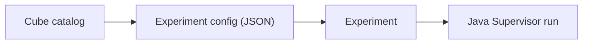

# Сущность: Cube (куб)

## Назначение

**Cube** - переиспользуемый вычислительный блок (узел графа), который описывает параметры, входы/выходы и тип исполнения. Кубы используются при сборке графа эксперимента и в редакторе пайплайна.

Практически, куб - это элемент каталога "строительных блоков" для экспериментов: его конфигурация попадает в JSON-конфиг пайплайна перед отправкой в супервизор.

## Связь с другими сущностями

- Кубы входят в конфиг эксперимента (см. [experiment.md](experiment.md)).
- Граф проекта получает сведения о состоянии узлов, где часть узлов соответствует экспериментам/датасетам, а сами конфиги содержат описания кубов.
- ACL применяет отдельные права к объекту типа `cube`.

## Модель данных

| Таблица | Назначение | DBML |
|---------|------------|------|
| `t_cubes` | Каталог системных кубов | [L435-L446](../database/cplane.dbml#L435-L446) |

Ключевые поля:
- `name` - уникальное имя куба.
- `params` (`jsonb`) - параметры куба.
- `params_name` - имя структуры параметров.
- `type` - тип куба (`CIT_CUBE`, `CIT_RESHARDER`, `CIT_RETRY`).
- `base_id` - ссылка на базовый куб (self-reference).

## HTTP API

Маршруты: [`backend/internal/handlers/private/handlers.go`](../../backend/internal/handlers/private/handlers.go), реализации: [`cube_crud.go`](../../backend/internal/handlers/private/cube_crud.go).

| Метод | Путь | Назначение |
|-------|------|------------|
| POST | `/api/v1/cube/system` | создать системный куб |
| GET | `/api/v1/cube` | получить куб по `cube_id` |
| GET | `/api/v1/cube/name` | получить куб по имени |
| GET | `/api/v1/cubes` | список кубов |
| GET | `/api/v1/cubes/by_ids` | список по массиву id |
| PUT | `/api/v1/cube` | обновить куб |

## Сервис

Основная логика: [`backend/internal/service/cube/cube_service.go`](../../backend/internal/service/cube/cube_service.go).

- `CreateCube` - создание с дефолтами:
  - `params_name = <name>Params`, если не передан;
  - `params = {}`, если пусто;
  - `type = CIT_CUBE`, если пусто.
- `UpdateCube` - обновление с теми же дефолтами.
- `ListCubes`, `ListCubesByIDs`, `GetCubeByID`, `GetCubeByName` - чтение каталога.

## DTO / requests / responses

- DTO: [`entities/dto/cube_dto.go`](../../backend/internal/entities/dto/cube_dto.go) (`Cube`, `CubeType`, `CubeParams`).
- Запросы: [`entities/requests/cube_requests.go`](../../backend/internal/entities/requests/cube_requests.go).
- Ответы: [`entities/responses/cube_responses.go`](../../backend/internal/entities/responses/cube_responses.go).

Типы кубов в DTO:
- `CIT_CUBE` - базовый вычислительный куб.
- `CIT_RESHARDER` - служебный куб ресхардинга.
- `CIT_RETRY` - служебный retry-куб.

## Особенности и ограничения

- **Каталог системных кубов:** endpoint `POST /api/v1/cube/system` создает именно системные записи в каталоге.
- **JSON-параметры:** `params` хранятся как `jsonb`; при пустом значении сервис проставляет `{}`.
- **Права доступа:** create/update проходят через ACL-проверки (`acl.Cube`, `acl.CubeAttribute`), read ручки сейчас без явной проверки на уровне handler.
- **Наследование:** поле `base_id` позволяет строить иерархию кубов.
- **Уникальность имени:** `t_cubes.name` уникален; используйте стабильный нейминг, чтобы избежать конфликтов между средами.

## См. также

- [experiment.md](experiment.md)
- [control-loop.md](../architecture/control-loop.md)
- [README.md](../README.md)
