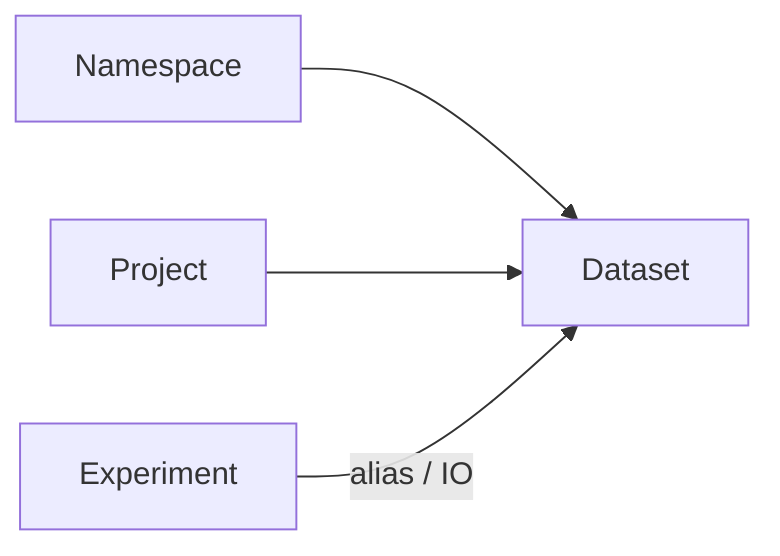

# Сущность: Dataset (датасет)

## Назначение

**Dataset** описывает источник/приёмник данных (тип, параметры, схема), может принадлежать **namespace** и/или **проекту**, участвовать в **экспериментах** через алиас (`t_experiment_dataset`) или I/O-связь (`t_experiment_io`). Имеет **версионирование** (`t_dataset_v`).

## Связь с другими сущностями

- [**Namespace**](namespace.md) — `t_dataset.namespace_id` (nullable в схеме).
- [**Project**](project.md) — `t_dataset.project_id` (опционально).
- [**Experiment**](experiment.md) — `t_experiment_dataset` (**alias**), `t_experiment_io` (`ds_type`, `ds_id`).

## Модель данных

| Таблица / представление | Описание | DBML |
|-------------------------|----------|------|
| `t_dataset` | Имя, тип, params, schema, флаги `public`/`managed`/`external`, **`version_id`** | [L168–L183](../database/cplane.dbml#L168-L183) |
| `t_dataset_v` | История версий (тип, params, schema, комментарий, автор) | [L185–L197](../database/cplane.dbml#L185-L197) |
| `t_dataset_update_log` | Аудит | [L327–L343](../database/cplane.dbml#L327-L343) |
| `t_experiment_dataset` | Связь эксперимент ↔ датасет с **`alias`** | [L217–L227](../database/cplane.dbml#L217-L227) |
| `t_experiment_io` | I/O по типу | [L210–L215](../database/cplane.dbml#L210-L215) |
| `v_real_dataset` | Представление | шапка [L4–L10](../database/cplane.dbml#L4-L10) |

## HTTP API

Регистрация: [`handlers.go`](../../backend/internal/handlers/private/handlers.go). Реализация: [`dataset_crud.go`](../../backend/internal/handlers/private/dataset_crud.go). Логи: [`update_logs.go`](../../backend/internal/handlers/private/update_logs.go).

| Метод | Путь | Назначение |
|-------|------|------------|
| POST | `/api/v2/dataset/config/validate` | validate config |
| POST | `/api/v2/dataset` | create |
| POST | `/api/v2/dataset/copy` | copy |
| POST | `/api/v2/datasets/search` | search |
| GET | `/api/v2/dataset/links` | linked experiments |
| GET | `/api/v2/datasets` | list by project |
| GET | `/api/v2/dataset` | get |
| DELETE | `/api/v1/dataset` | delete |
| PUT | `/api/v2/dataset` | update |
| POST | `/api/v1/dataset/apply` | apply dataset (тело запроса) |
| GET | `/api/v1/dataset/logs` | logs by namespace context |
| GET | `/api/v2/dataset/logs` | logs by project context |
| GET/PUT | `/api/v1/dataset/log` | одна запись / комментарий |
| GET/PUT | `/api/v2/dataset/versions`, `/api/v2/dataset/version`, `/api/v2/dataset/version/current` | версии |
| GET | `/api/v2/forms/dataset` | форма по типу | [`handlers.go`](../../backend/internal/handlers/private/handlers.go) |

## Сервис

[`backend/internal/service/dataset/dataset_service.go`](../../backend/internal/service/dataset/dataset_service.go):

- **`CreateDataset`**, **`UpdateDataset`** (новая строка в `t_dataset_v`), **`DeleteDataset`**, **`CopyDataset`**
- **`ListDatasetByProject`**, **`SearchDatasets`**, **`GetDataset`**, **`GetDatasetWithProjectInfo`**
- **`GetDatasetLinkedExperiments`**

## DTO / requests / responses

- [`dataset_dto.go`](../../backend/internal/entities/dto/dataset_dto.go)
- [`dataset_requests.go`](../../backend/internal/entities/requests/dataset_requests.go)
- [`dataset_responses.go`](../../backend/internal/entities/responses/dataset_responses.go)
- [`dataset_setters.go`](../../backend/internal/entities/setters/dataset_setters.go)
- [`dataset_validation.go`](../../backend/internal/entities/validation/dataset_validation.go)
- [`models/dataset_config.go`](../../backend/internal/entities/models/dataset_config.go)

## Репозиторий и SQL

[`repository.go`](../../backend/internal/repository/repository.go); [`datasets.sql`](../../backend/internal/db/queries/datasets.sql), [`update_log.sql`](../../backend/internal/db/queries/update_log.sql), при необходимости [`core_crud.sql`](../../backend/internal/db/queries/core_crud.sql). Формы: [`internal/repository/forms`](../../backend/internal/repository/forms).

## Версионирование

У **`t_dataset`** поле **`version_id`** указывает на текущую «голову»; история — строки в **`t_dataset_v`** (инкремент `version`, снимок type/params/schema/public/managed).

## Журнал изменений

**`t_dataset_update_log`** — записи изменений; API `/api/v1/dataset/logs` и `/api/v2/dataset/logs` (разный контекст namespace vs project).

## ACL

Проверки прав в [`dataset_crud.go`](../../backend/internal/handlers/private/dataset_crud.go) и связанных handlers. См. [`internal/pkg/acl`](../../backend/internal/pkg/acl).

## См. также

- [experiment.md](experiment.md) — привязка датасетов и `experiment_dataset` / `experiment_io`
- [project.md](project.md), [namespace.md](namespace.md)
- [README.md](../README.md)
