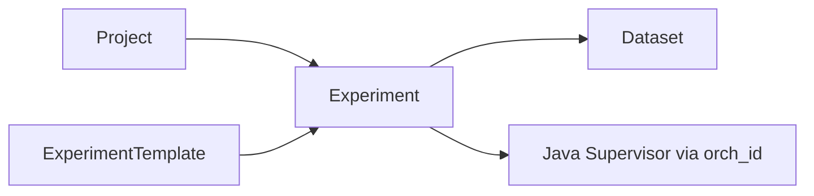

# Сущность: Experiment (эксперимент) и шаблон

## Назначение

**Experiment** — экземпляр пайплайна внутри **проекта**, привязанный к версии **шаблона эксперимента** (`template_v_id`). Хранит статус, **`orch_id`** для супервизора, переменные с версиями, связи с датасетами и применённый конфиг (`t_experiment_status`). CPLANE управляет жизненным циклом через API и интеграции — см. [контур управления](../architecture/control-loop.md).

## Связь с другими сущностями

- [**Проект**](project.md) — `t_experiment.project_id`.
- **Шаблон эксперимента** — `t_experiment_template` / `t_experiment_template_v` → `template_v_id` (см. раздел «Модель данных» ниже).
- [**Датасеты**](dataset.md) — `t_experiment_dataset` (алиас), `t_experiment_io` (тип I/O).
- **Java-супервизор** — команды RabbitMQ, статус HTTP; подробно [supervisor-architecture.md](../architecture/supervisor-architecture.md) и [control-loop.md](../architecture/control-loop.md).

## Модель данных

| Таблица / представление | Описание | DBML |
|-------------------------|----------|------|
| `t_experiment_template` | Шаблон (namespace, имя) | [L147–L153](../database/cplane.dbml#L147-L153) |
| `t_experiment_template_v` | Версии YQL/config шаблона | [L155–L166](../database/cplane.dbml#L155-L166) |
| `t_experiment` | Экземпляр: `template_v_id`, `project_id`, `status`, **`orch_id`** | [L199–L208](../database/cplane.dbml#L199-L208) |
| `t_experiment_io` | Связь experiment ↔ dataset по типу I/O | [L210–L215](../database/cplane.dbml#L210-L215) |
| `t_experiment_dataset` | Привязка датасета с **`alias`** | [L217–L227](../database/cplane.dbml#L217-L227) |
| `t_experiment_variable` | Переменная, указатель версии | [L229–L242](../database/cplane.dbml#L229-L242) |
| `t_experiment_variable_v` | История значений | [L244–L253](../database/cplane.dbml#L244-L253) |
| `t_experiment_status` | Применённая версия, `orch_config` | [L255–L265](../database/cplane.dbml#L255-L265) |
| `t_experiment_update_log` | Аудит | [L345–L360](../database/cplane.dbml#L345-L360) |
| `v_real_experiment`, `v_real_experiment_template` | Представления | шапка [L4–L10](../database/cplane.dbml#L4-L10) |

## HTTP API

Регистрация: [`handlers.go`](../../backend/internal/handlers/private/handlers.go).

### Complete experiment (CRUD)

Файл: [`complete_experiment_crud.go`](../../backend/internal/handlers/private/complete_experiment_crud.go).

| Метод | Путь | Назначение |
|-------|------|------------|
| POST | `/api/v1/experiment` | create |
| POST | `/api/v1/experiment/copy` | copy |
| GET | `/api/v1/experiments` | list by project |
| GET | `/api/v1/experiment` | get |
| DELETE | `/api/v1/experiment` | delete |
| PUT | `/api/v1/experiment` | update |

### Действия и супервизор

| Метод | Путь | Назначение | Файл |
|-------|------|------------|------|
| PUT | `/api/v1/experiment/start` | start | [`experiment_actions.go`](../../backend/internal/handlers/private/experiment_actions.go) |
| PUT | `/api/v1/experiment/stop` | stop | `experiment_actions.go` |
| GET | `/api/v1/experiment/status` | status | `experiment_actions.go` |
| GET | `/api/v1/experiment/updates` | check config updates | `experiment_actions.go` |
| PUT | `/api/v1/experiment/config/apply` | apply | [`apply_experiment_config.go`](../../backend/internal/handlers/private/apply_experiment_config.go) |
| PUT | `/api/v2/experiment/config/apply` | apply v2 |同上 |
| PUT | `/api/v3/experiment/config/apply` | apply v3 |同上 |
| POST | `/api/v1/experiment/config/apply/save` | save applied version | [`handlers.go`](../../backend/internal/handlers/private/handlers.go) |
| POST | `/api/v2/experiment/config/validate` | validate config | [`handlers.go`](../../backend/internal/handlers/private/handlers.go) |
| POST | `/api/v1/experiment/validations/fast` | fast validation | [`handlers.go`](../../backend/internal/handlers/private/handlers.go) |
| POST | `/api/v1/experiment/validations/run` | run validation | [`handlers.go`](../../backend/internal/handlers/private/handlers.go) |
| GET | `/api/v1/experiment/supervisor` | supervisor JSON | [`supervisor.go`](../../backend/internal/handlers/private/supervisor.go) |

### Датасеты эксперимента

| Метод | Путь | Назначение |
|-------|------|------------|
| POST | `/api/v1/experiment/dataset` | add |
| DELETE | `/api/v1/experiment/dataset` | remove |
| PUT | `/api/v1/experiment/dataset` | update |
| GET | `/api/v1/experiment/datasets` | list |
| POST | `/api/v2/experiment/search/datasets` | search available |
| POST | `/api/v1/experiment/dataset/apply` | apply dataset link | [`handlers.go`](../../backend/internal/handlers/private/handlers.go) |

### Переменные и версии конфига

| Метод | Путь | Назначение |
|-------|------|------------|
| GET/POST/PUT/DELETE | `/api/v1/experiment/variable(s)` | CRUD переменных | [`handlers.go`](../../backend/internal/handlers/private/handlers.go) |
| GET | `/api/v1/experiment/variables/types` | типы |
| GET/PUT | `/api/v2/experiment/variable/versions`, `.../version`, `.../version/current` | версии переменных |
| GET | `/api/v1/experiment/logs`, `/api/v1/experiment/versions` | логи и версии конфига |
| GET/PUT | `/api/v1/experiment/log` | одна запись лога |
| GET/PUT | `/api/v1/experiment/version`, `/api/v1/experiment/version/current` | версия конфига |
| PUT | `/api/v2/experiment/version` | комментарий к версии | [`versions.go`](../../backend/internal/handlers/private/versions.go) |
| PUT | `/api/v1/experiment/queue/clean` | clean queue | [`handlers.go`](../../backend/internal/handlers/private/handlers.go) |

### Прочее

| Метод | Путь | Назначение |
|-------|------|------------|
| GET | `/api/v1/experiment/urls` | URLs |
| GET | `/api/v1/experiment/grafana_url` | Grafana |

### Jobs (связано с запусками)

[`experiment_jobs.go`](../../backend/internal/handlers/private/experiment_jobs.go): `POST /api/v1/jobs/search`, `GET /api/v1/job`, `GET /api/v1/job/events`, `GET /api/v1/events`, `POST /api/v1/job/cancel`, `POST /api/v1/job/retry`, `GET /api/v1/job/tasks`.

## Сервис

| Файл | Роль |
|------|------|
| [`experiment_service.go`](../../backend/internal/service/experiment/experiment_service.go) | CRUD complete experiment, copy, списки, **`UpdateExperimentOrchID`** при create/copy, переменные |
| [`experiment_actions_service.go`](../../backend/internal/service/experiment/experiment_actions_service.go) | `StartExperiment`, `StopExperiment`, `ApplyExperimentConfig`, `GetExperimentStatus`, `GetSupervisorConfig`, привязка датасетов, переменные с версиями, `GetSupervisorExperimentID` |

Интерфейсы: [`service.go`](../../backend/internal/service/service.go) (`IExperimentService`).

## DTO / requests / responses

- [`experiment_dto.go`](../../backend/internal/entities/dto/experiment_dto.go), [`variables_dto.go`](../../backend/internal/entities/dto/variables_dto.go), [`versions_dto.go`](../../backend/internal/entities/dto/versions_dto.go)
- [`experiment_requests.go`](../../backend/internal/entities/requests/experiment_requests.go)
- [`experiment_responses.go`](../../backend/internal/entities/responses/experiment_responses.go) — в т.ч. `SupervisorExperimentRun`
- [`experiment_config.go`](../../backend/internal/entities/models/experiment_config.go)
- [`experiment_validation.go`](../../backend/internal/entities/validation/experiment_validation.go), [`experiment_setters.go`](../../backend/internal/entities/setters/experiment_setters.go)

## Репозиторий и SQL

[`repository.go`](../../backend/internal/repository/repository.go); в первую очередь:

- [`complete_experiment_info.sql`](../../backend/internal/db/queries/complete_experiment_info.sql)
- [`experiment_actions.sql`](../../backend/internal/db/queries/experiment_actions.sql)
- [`datasets.sql`](../../backend/internal/db/queries/datasets.sql)
- [`versions.sql`](../../backend/internal/db/queries/versions.sql)
- [`update_log.sql`](../../backend/internal/db/queries/update_log.sql)
- [`core_crud.sql`](../../backend/internal/db/queries/core_crud.sql)

## Версионирование

- **Шаблон:** `t_experiment.template_v_id` → `t_experiment_template_v`.
- **Переменные:** новые строки в **`t_experiment_variable_v`**, поле **`version_id`** у переменной.
- **Применённый конфиг:** **`t_experiment_status`** после успешного **apply** (см. [control-loop](../architecture/control-loop.md)).

## Жизненный цикл и `orch_id` (кратко)

- **`orch_id`** — строковый идентификатор пайплайна для супервизора; при HTTP-статусе должен быть положительным числом.
- **Start / Stop / Apply** — через RabbitMQ; детальный сценарий и маппинг статусов — [control-loop.md](../architecture/control-loop.md).

## Журнал изменений

**`t_experiment_update_log`** — операции, включая start/stop/apply (см. handlers в `experiment_actions.go`, `apply_experiment_config.go`).

## ACL

Проверки в соответствующих handlers (CRUD, start/stop/apply, датасеты, переменные). Базовый пакет: [`internal/pkg/acl`](../../backend/internal/pkg/acl).

## См. также

- [control-loop.md](../architecture/control-loop.md)
- [supervisor-architecture.md](../architecture/supervisor-architecture.md)
- [project.md](project.md), [dataset.md](dataset.md)
- [README.md](../README.md)
