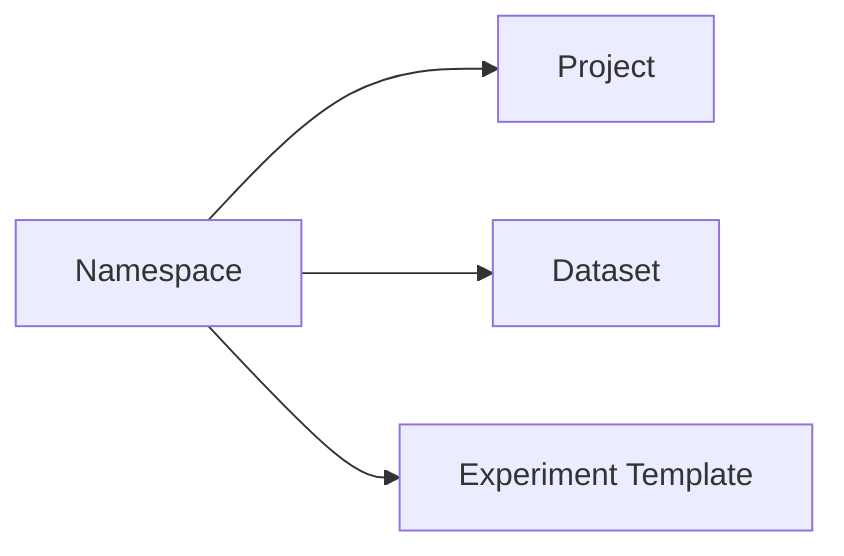

# Сущность: Namespace (рабочая область)

## Назначение

**Namespace** — изолированная рабочая область: контейнер для проектов, датасетов (часть сценариев), шаблонов экспериментов и ACL. Имеет версионируемый JSON-конфиг и журнал изменений.

## Связь с другими сущностями

- Содержит [**проекты**](project.md) (`t_project.namespace_id`).
- Датасеты и шаблоны экспериментов могут ссылаться на namespace (см. [`cplane.dbml`](../database/cplane.dbml)).
- При создании namespace создаётся **роль владельца** ([`owner_roles`](../../backend/internal/pkg/owner_roles)).

## Модель данных

| Таблица / представление | Описание | DBML |
|-------------------------|----------|------|
| `t_namespace` | Имя, `deleted`, текущая версия конфига | [L101–L108](../database/cplane.dbml#L101-L108) |
| `t_namespace_config_v` | История версий JSON-конфига | [L110–L120](../database/cplane.dbml#L110-L120) |
| `t_namespace_variable` | Переменные уровня namespace | [L281–L293](../database/cplane.dbml#L281-L293) |
| `t_namespace_update_log` | Аудит (в миграциях без FK на сущность) | [L295–L308](../database/cplane.dbml#L295-L308) |
| `v_real_namespace` | Представление «не удалённые» | шапка [L4–L10](../database/cplane.dbml#L4-L10) |

## HTTP API

Регистрация: [`handlers.go`](../../backend/internal/handlers/private/handlers.go). Реализация CRUD: [`namespace_handlers.go`](../../backend/internal/handlers/private/namespace_handlers.go). Логи: [`update_logs.go`](../../backend/internal/handlers/private/update_logs.go).

| Метод | Путь | Swagger summary | Файл / функция |
|-------|------|-------------------|----------------|
| POST | `/api/v1/namespace` | create namespace | `createNamespaceHandler` |
| GET | `/api/v1/namespaces` | list namespaces | `listNamespacesHandler` |
| GET | `/api/v2/namespaces` | list namespaces v2 | `listNamespacesV2Handler` |
| DELETE | `/api/v1/namespace` | delete namespace | `deleteNamespaceHandler` |
| PUT | `/api/v1/namespace` | update namespace | `updateNamespaceHandler` |
| GET | `/api/v1/namespace/configs` | list namespace configs | `listNamespaceConfigsHandler` |
| GET | `/api/v1/namespace/config` | get namespace config by id | `getNamespaceConfigHandler` |
| GET | `/api/v1/namespace` | get namespace | `getNamespaceHandler` |
| GET | `/api/v1/namespace/logs` | (список логов) | `listNamespaceUpdateLogsHandler` |
| GET | `/api/v1/namespace/log` | (одна запись лога) | `getNamespaceLogHandler` |
| PUT | `/api/v1/namespace/log` | (комментарий к логу) | `updateNamespaceLogCommentHandler` |

## Сервис

[`backend/internal/service/namespace/namespace_service.go`](../../backend/internal/service/namespace/namespace_service.go):

- **`CreateNamespace`** — создание строки, пустой конфиг `{}`, первая версия в `t_namespace_config_v`.
- **`UpdateNamespace`** — смена имени и/или новая версия конфига.
- **`DeleteNamespace`** — проверки (нет «живых» проектов/датасетов в NS), soft-delete.
- **`GetNamespace`**, **`ListNamespacesWithRights`**, **`ListNamespacesV2`**, **`ListNamespaceConfigs`**, **`GetNamespaceConfig`**.

Журнал: [`internal/service/history/update_log/log_service.go`](../../backend/internal/service/history/update_log/log_service.go) — `LogNamespaceChange`, `ListNamespaceUpdateLogs`, …

## DTO / requests / responses

- [`namespace_dto.go`](../../backend/internal/entities/dto/namespace_dto.go)
- [`namespace_requests.go`](../../backend/internal/entities/requests/namespace_requests.go)
- [`namespace_responses.go`](../../backend/internal/entities/responses/namespace_responses.go)
- [`namespace_setters.go`](../../backend/internal/entities/setters/namespace_setters.go)
- Логи: [`log_dto.go`](../../backend/internal/entities/dto/log_dto.go), `log_requests.go`, `log_responses.go`

## Репозиторий и SQL

[`backend/internal/repository/repository.go`](../../backend/internal/repository/repository.go) + sqlc-запросы: [`core_crud.sql`](../../backend/internal/db/queries/core_crud.sql), [`configs.sql`](../../backend/internal/db/queries/configs.sql), [`update_log.sql`](../../backend/internal/db/queries/update_log.sql).

## Версионирование

Текущая версия конфига — поле **`namespace_version_id`** в `t_namespace`; история — **`t_namespace_config_v`** (`namespace_id`, `version_id`, `config` jsonb).

## Журнал изменений

**`t_namespace_update_log`** — вставки из сервиса при create/update/delete; чтение через API выше. Детали в [`internal/pkg/update_log`](../../backend/internal/pkg/update_log).

## ACL

Примеры из [`namespace_handlers.go`](../../backend/internal/handlers/private/namespace_handlers.go):

- Создание: `acl.Root`, `acl.NamespaceAttribute`, `acl.Create`.
- Удаление: `acl.Namespace`, `acl.NoAttribute`, `acl.Delete`.
- Обновление метаданных/имени: `acl.Namespace`, `acl.MetaAttribute`, `acl.Edit`.
- Список конфигов: `acl.Namespace`, `acl.ConfigAttribute`, `acl.Read`.
- Список v1: глобальные права `RightCreateNamespace` для флага `CanCreate`.

См. [`internal/pkg/acl`](../../backend/internal/pkg/acl).

## См. также

- [project.md](project.md)
- [dataset.md](dataset.md)
- [README.md](../README.md)
- [TEMPLATE.md](../TEMPLATE.md)
