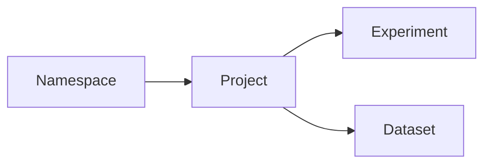

# Сущность: Project (проект)

## Назначение

**Project** принадлежит **namespace** и объединяет эксперименты, датасеты (опционально `project_id`), переменные уровня проекта и JSON-конфиг с версионированием. Поддерживаются закреплённые проекты пользователя (**pinned**).

## Связь с другими сущностями

- Родитель: [**namespace**](namespace.md) (`t_project.namespace_id`).
- Содержит [**эксперименты**](experiment.md) (`t_experiment.project_id`).
- Датасеты могут быть привязаны к проекту (`t_dataset.project_id`).

## Модель данных

| Таблица / представление | Описание | DBML |
|-------------------------|----------|------|
| `t_project` | Имя, описание, `deleted`, текущая версия конфига | [L122–L133](../database/cplane.dbml#L122-L133) |
| `t_project_config_v` | История версий конфига | [L135–L145](../database/cplane.dbml#L135-L145) |
| `t_project_variable` | Переменные проекта | [L267–L277](../database/cplane.dbml#L267-L277) |
| `t_project_update_log` | Аудит | [L310–L323](../database/cplane.dbml#L310-L323) |
| `t_user_pinned_projects` | Закладки пользователя | [L362–L369](../database/cplane.dbml#L362-L369) |
| `v_real_project` | Представление «не удалённые» | шапка [L4–L10](../database/cplane.dbml#L4-L10) |

## HTTP API

Регистрация: [`handlers.go`](../../backend/internal/handlers/private/handlers.go). Реализация: [`project_crud.go`](../../backend/internal/handlers/private/project_crud.go). Логи: [`update_logs.go`](../../backend/internal/handlers/private/update_logs.go).

| Метод | Путь | Назначение | Handler |
|-------|------|------------|---------|
| POST | `/api/v1/project` | create project | `createProjectHandler` |
| POST | `/api/v2/project/pinned` | add pinned | `addPinnedProjectHandler` |
| POST | `/api/v2/project/config/validate` | validate project config | `validateProjectConfigHandler` |
| GET | `/api/v1/projects` | list projects in namespace | `listProjectsHandler` |
| GET | `/api/v2/projects/pinned` | list pinned | `listPinnedProjectsHandler` |
| POST | `/api/v2/projects` | search / list v2 | `listProjectsPostHandlerV2` |
| GET | `/api/v2/project` | get project by id (v2) | `getProjectV2Handler` |
| DELETE | `/api/v1/project` | delete project | `deleteProjectHandler` |
| DELETE | `/api/v2/project/pinned` | delete pin | `deletePinnedProjectHandler` |
| PUT | `/api/v1/project` | update project | `updateProjectHandler` |
| GET | `/api/v1/project/configs` | list project configs | `listProjectConfigsHandler` |
| GET | `/api/v1/project/config` | get project config by id | `getProjectConfigHandler` |
| GET | `/api/v1/project/logs` | list project update logs | `listProjectUpdateLogsHandler` |
| GET | `/api/v1/project/log` | get project log | `getProjectLogHandler` |
| PUT | `/api/v1/project/log` | update project log comment | `updateProjectLogCommentHandler` |
| GET | `/api/v2/project/urls` | get project urls | `getProjectURLsHandler` |

## Сервис

[`backend/internal/service/project/project_service.go`](../../backend/internal/service/project/project_service.go):

- **`CreateProject`**, **`UpdateProject`**, **`DeleteProject`** (блокировка при связанных экспериментах/датасетах, soft-delete).
- **`ListProjects`**, **`ListProjectsV2`**, **`GetProjectInfo`**, **`GetProjectInfoV2`**.
- **`ListProjectConfigs`**, **`GetProjectConfig`**.
- **`AddPinnedProject`**, **`ListPinnedProjects`**, **`DeletePinnedProject`**, **`GetProjectURLs`**.

Журнал: `LogProjectChange`, `ListProjectUpdateLogs`, … в [`log_service.go`](../../backend/internal/service/history/update_log/log_service.go).

## DTO / requests / responses

- [`project_dto.go`](../../backend/internal/entities/dto/project_dto.go)
- [`project_requests.go`](../../backend/internal/entities/requests/project_requests.go)
- [`project_responses.go`](../../backend/internal/entities/responses/project_responses.go)
- [`project_validation.go`](../../backend/internal/entities/validation/project_validation.go)
- [`project_setters.go`](../../backend/internal/entities/setters/project_setters.go)
- [`models/project_config.go`](../../backend/internal/entities/models/project_config.go)

## Репозиторий и SQL

[`repository.go`](../../backend/internal/repository/repository.go); [`core_crud.sql`](../../backend/internal/db/queries/core_crud.sql), [`configs.sql`](../../backend/internal/db/queries/configs.sql), [`pinned_projects.sql`](../../backend/internal/db/queries/pinned_projects.sql), [`update_log.sql`](../../backend/internal/db/queries/update_log.sql).

## Версионирование

**`project_version_id`** в `t_project` → текущая строка в **`t_project_config_v`**.

## Журнал изменений

**`t_project_update_log`** — операции над проектом; чтение через `/api/v1/project/logs` и `/api/v1/project/log`.

## ACL

Примеры из [`project_crud.go`](../../backend/internal/handlers/private/project_crud.go):

- Создание в namespace: `acl.Namespace`, `acl.ProjectAttribute`, `acl.Create`.
- Список в namespace: `acl.Namespace`, `acl.ProjectAttribute`, `acl.Read`.
- Удаление: `acl.Project`, `acl.NoAttribute`, `acl.Delete`.
- Обновление: `acl.Project`, `acl.MetaAttribute`, `acl.Edit`.
- Чтение v2 / конфигов / логов: `acl.Project`, `acl.MetaAttribute`, `acl.Read` (и варианты с `namespace_id` для списков).

См. [`internal/pkg/acl`](../../backend/internal/pkg/acl).

## См. также

- [namespace.md](namespace.md)
- [experiment.md](experiment.md)
- [dataset.md](dataset.md)
- [README.md](../README.md)
