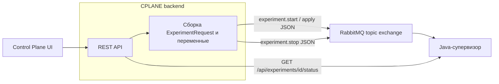

# Архитектура взаимодействия Control Plane с супервизором

Супервизор (в продуктовом контуре — Java-сервис из репозитория `skif_platform_supervisor`) выполняет фактический запуск пайплайна: очередь моделей, переходы между этапами, статусы. Backend Control Plane (CPLANE) пайплайн не исполняет: он собирает конфигурацию из PostgreSQL, публикует команды в RabbitMQ и при необходимости опрашивает HTTP API супервизора для отображения статуса в UI.

## Границы ответственности

| Компонент | Роль |
|-----------|------|
| CPLANE backend | Данные эксперимента, ACL, сборка JSON для супервизора, публикация в RabbitMQ, проксирование статуса в API CPLANE |
| RabbitMQ | Транспорт команд «старт / стоп / применить конфиг» |
| Java-супервизор | Потребление сообщений из очереди, исполнение пайплайна, отдача статуса по HTTP |

## Логическая схема

- **Команды** передаются только через **RabbitMQ** (асинхронно).
- **Статус и детализация по моделям** приходят по **HTTP** с backend CPLANE к супервизору, если задан `clients.supervisor.base_url` в конфигурации.

## Канал команд: RabbitMQ

### Топология

Используется **topic exchange** (по умолчанию имя `cplane.events`, тип `topic`). Сообщения публикуются с routing key:

| Ключ | Назначение |
|------|------------|
| `experiment.start` | Запуск пайплайна |
| `experiment.stop` | Остановка |
| `experiment.apply` | Применение конфигурации (тело того же вида, что и для старта) |

Тело сообщений: JSON, тип содержимого в брокере задаётся как `application/json`, режим доставки — persistent.

Параметры подключения и имена exchange/routing key задаются в секции `clients.rabbitmq` конфигурации backend (см. [`config.local.yaml`](../backend/config.local.yaml) как пример локального профиля).

### Поведение без RabbitMQ

Если клиент RabbitMQ не создан (`enabled: false` или ошибка при инициализации), операции запуска, остановки и применения конфигурации возвращают ошибку: без брокера супервизор команды от CPLANE не получает.

### Форматы тел сообщений

- **`experiment.start` и `experiment.apply`** — сериализованный запрос эксперимента (`internal/pkg/supervisor`), совместимый с моделью входа клиента в `skif_platform_supervisor` (см. комментарий в `internal/clients/rabbitmq/events.go`).
- **`experiment.stop`** — структура с полями `experiment_id` (идентификатор эксперимента в CPLANE) и `supervisor_experiment_id` (значение поля **`orch_id`** в БД — идентификатор запуска в рантайме супервизора).

Перед отправкой к запросу применяются **переменные эксперимента** (`internal/pkg/supervisorenrich`).

### Очередь супервизора (опционально)

Параметр `supervisor_queue` в конфиге RabbitMQ задаёт имя очереди, на которую подписан consumer супервизора (аналог переменной окружения `SUPERVISOR_QUEUE` у consumer). По этому имени backend может выполнить passive declare и получить число сообщений в состоянии ready — для отображения глубины очереди в списке задач вместе с живым HTTP-статусом (`internal/clients/rabbitmq/client.go`, обогащение в `internal/handlers/private/experiment_jobs.go`).

## Канал статуса: HTTP

### Запрос

Реализация в `internal/pkg/supervisorstatus`: запрос вида

`GET {clients.supervisor.base_url}/api/experiments/{experimentId}/status`

где `{experimentId}` — числовой идентификатор пайплайна в супервизоре. В CPLANE он берётся из **`orch_id`** эксперимента (должен успешно парситься как положительное целое).

### Ответ и маппинг

Ответ JSON маппится в нормализованную структуру **`SupervisorExperimentRun`** (`internal/entities/responses/experiment_responses.go`): статус запуска, текущая модель, прогресс, массив **jobs** по этапам. Агрегированный статус эксперимента для общего API приводится к перечислению статусов CPLANE (`mapJavaSupervisorStatusToDTO` в `internal/service/experiment/experiment_actions_service.go`).

### Отсутствие base_url

Если `clients.supervisor.base_url` пустой, HTTP-опрос не выполняется; в ответе статуса может быть текст-заглушка о необходимости указать URL для отображения состояния пайплайна в UI.

Таймаут задаётся `clients.supervisor.timeout_ms`; при нуле в коде используется разумное значение по умолчанию.

## Сборка конфигурации пайплайна

Из БД загружается полный снимок эксперимента (`CompleteExperimentInfo`). Возможны два пути:

1. **Нативный layout супервизора** — если сохранённый JSON распознаётся как layout супервизора (`supervisor.IsSupervisorExperimentLayout`): используется `supervisor.RequestFromCompleteInfo`.
2. **Конвертация из модели оркестратора** — иначе конфиг собирается через `orch.ExperimentInfoToSupervisorPipelineConfig`.

Метод **`GetSupervisorConfig`** отдаёт итоговый JSON для отладки и интеграций; HTTP-маршрут в Swagger описан как pipeline config for supervisor (например `GET /api/v1/experiment/supervisor`).

## Конфигурация

Минимально необходимые секции в YAML backend:

- **`clients.rabbitmq`**: `enabled`, `host`, `port`, учётные данные, `vhost`, `exchange`, `routing_key`, `routing_key_stop`, `routing_key_apply`, при необходимости `exchange_kind`, `supervisor_queue`.
- **`clients.supervisor`**: `base_url`, `timeout_ms`.

## Связь с UI

- Просмотр собранного JSON: API supervisor config для эксперимента.
- Статус и таблица этапов по моделям: приходит в составе ответов статуса/задач; backend подмешивает живой статус супервизора и опционально счётчик очереди (`applyLiveSupervisorAndQueue`).

Типы на фронте с префиксом `ResponsesSupervisor*` в сгенерированных контрактах соответствуют этим DTO.

## Локальная связка

В [`docker-compose.yml`](../docker-compose.yml) описаны сервисы `rabbitmq`, `backend` и опционально `java-supervisor` (образ из соседнего каталога `skif_platform_supervisor`). В `config.local.yaml` для Docker-сети задаётся HTTP-супервизор, например `http://java-supervisor:8080`.

## Идентификаторы и типичные проблемы

- **`orch_id`** в CPLANE — строковый ID запуска в супервизоре; для HTTP-статуса нужен **положительный числовой** идентификатор. Несоответствие или отсутствие запуска даёт 404 или поясняющее сообщение в API.
- Нет **RabbitMQ** — команды start/stop/apply недоступны.
- Нет **`supervisor.base_url`** — детальный статус по HTTP в UI не подтягивается.

## Связанный код (ориентиры)

| Область | Пакет / файл |
|---------|----------------|
| Публикация в брокер | `internal/clients/rabbitmq/` |
| Тела сообщений | `internal/clients/rabbitmq/events.go` |
| Сборка запроса супервизору | `internal/pkg/supervisor/`, `internal/pkg/supervisorenrich/` |
| HTTP статус | `internal/pkg/supervisorstatus/` |
| Бизнес-логика эксперимента | `internal/service/experiment/experiment_actions_service.go` |
| Обогащение списка задач | `internal/handlers/private/experiment_jobs.go` |
